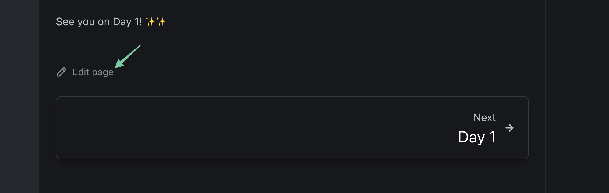

# The Missing Frappe Manual

Source code for the missing Frappe Manual site (powered by Astro Starlight): [manual.buildwithhussain.dev](https://manual.buildwithhussain.dev).

This site also contains the assignments for Frappe Framework Training Program.

## Contributing

In any page, you can scroll to the bottom and click on the **Edit page** button:

This will open this particular page's source in GitHub itself.
