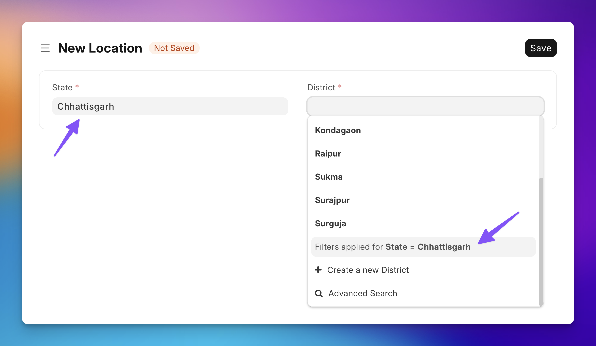
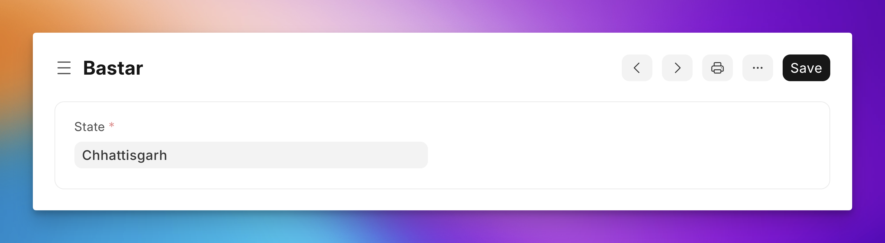

## Use Case

In India, there are states and each state has several districts. Suppose, we want to implement a **Location** form for India which asks the user to select a **State** and then a **District**. But we have to make sure the District field only shows districts belonging to the selected state:



The district doctype has a field which stores which State it belongs to:



## The Script

```js {3-9}
frappe.ui.form.on('Location', {
 refresh(frm) {
     frm.set_query("district", (doc) => {
         return {
             filters: {
                 "state": doc.state // whatever state is selected
             }
         }
     });
 }
})
```

The JS API that let's you apply filters to link fields is highlighted above. As you can see above, `doc` (in this case, the **Location** document) is provided for you. Here, `doc` is equivalent to `frm.doc`.

## Learn More

You can read more about `set_query` API [here](https://frappeframework.com/docs/user/en/guides/app-development/overriding-link-query-by-custom-script).
