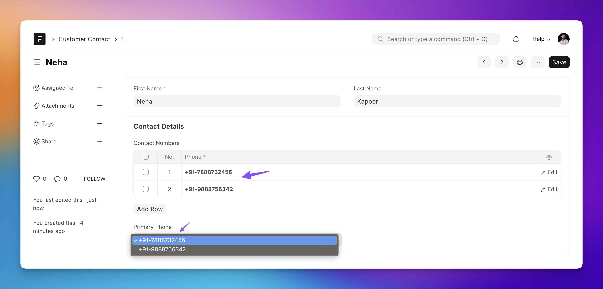

## Use Case

I have a DocType named **Customer Contact** with a child table for Contact Numbers:



As shown above, I want the **Primary Phone** field to be dynamically populated based on the contact numbers in the child table.

Let's get this done!

## The Client Script

:::note
DON'T add any options for the Select field from DocType form if you want to control it from client script dynamically. Otherwise, you will get validation errors from the backend based on the options set through DocType form.
:::

```js {5-11}
frappe.ui.form.on("Customer Contact", {
 refresh(frm) {
  frm.trigger("set_options_for_primary_contact"); // calls the method that follows, passing the `frm` object as argument.
 },
 set_options_for_primary_contact(frm) {
    // gives ["+91-8770886545", "+91-6774662564", ...]
    const phone_numbers = frm.doc.contact_numbers.map((contact_item) => contact_item.phone);

    // Set the options for the `primary_phone` select field
    frm.set_df_property("primary_phone", "options", phone_numbers);
 }
});

// Child table script
frappe.ui.form.on("Customer Phone", {
 // runs when any phone field is changed
 phone(frm) {
  frm.trigger("set_options_for_primary_contact")
 },

 // runs when a new row is added
 contact_numbers_add(frm) {
     frm.trigger("set_options_for_primary_contact");
 },

 // runs when a row is removed
 contact_numbers_remove(frm) {
     frm.trigger("set_options_for_primary_contact");
 },
});
```

The above script is also a good example of how you can **listen to row add and row remove events for a child table.**

:::tip
You can also pass a list of objects with separate `label` and `value` as **options**:

```json
[
    {"label": "Apple iPhone 16", "value": "apple-iphone-16"},
    ...
]
```

:::

## Controlling More DocField Properties

Similar to the above use case, you can use client scripts to show/hide fields, mark them read-only, and more, using the `set_df_property` method:

```js
// hide a field
frm.set_df_property("blogger", "hidden", 1); // 0 to un-hide

// make a field read only
frm.set_df_property("blogger", "read_only", 1);
```
