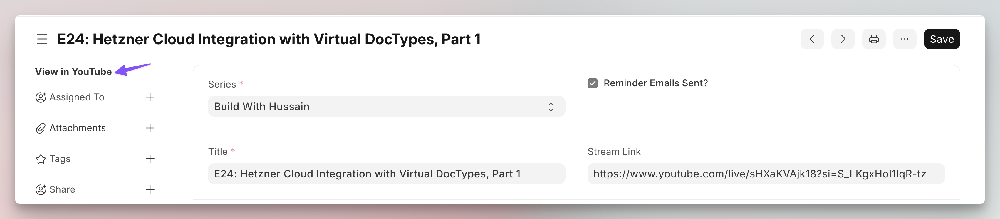

```js
// Assuming there is a "Live Stream" DocType 
// with a field `stream_link` that has the link to a YouTube video
frappe.ui.form.on('Live Stream', {
 refresh(frm) {
    const stream_link = frm.doc.stream_link;
    frm.add_web_link(stream_link, "View in YouTube");
 }
})
```

:::note
The link opens in a new browser tab. You can add multiple of these web links.
:::
