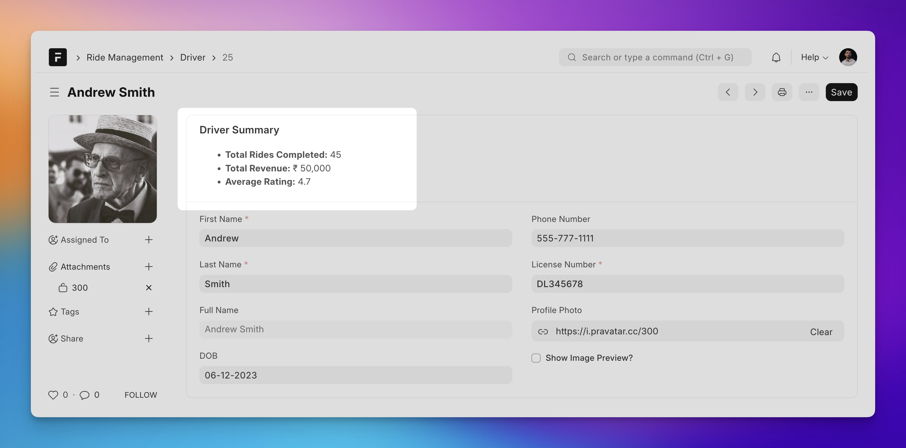
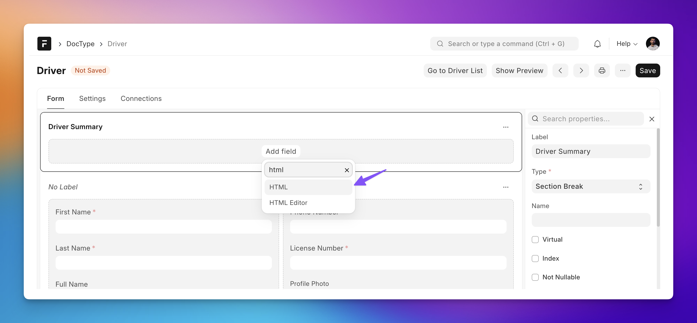
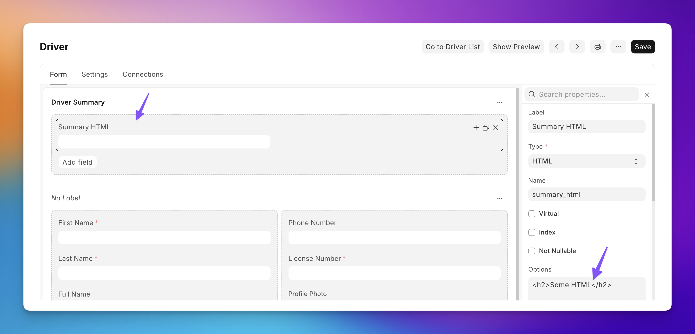
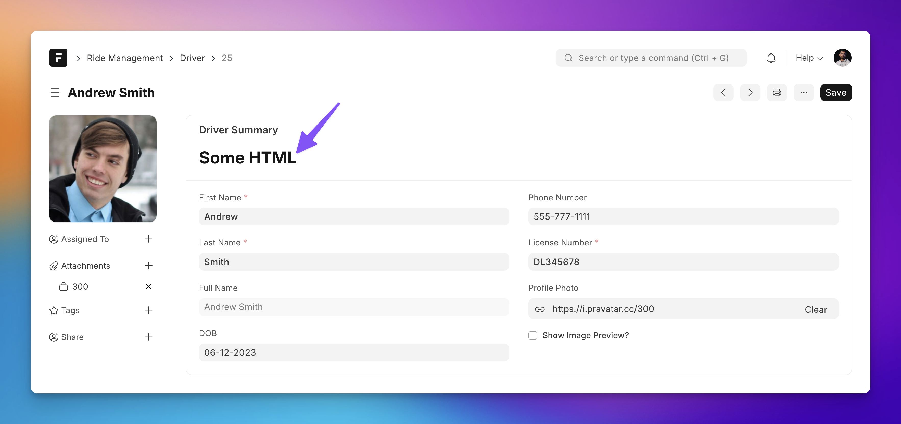

This example shows how to render arbitrary HTML in Form View using HTML field

## Use Case

I have a DocType named **Driver** in my hypothetical Ride Management app. I want to show a summary of rides by a driver right in the form view like shown below:



The details include the number of rides the driver has completed (think Uber 😆), total revenue from those rides, and average rating.

## The Backend API

This data is returned from backend by an API script (`/api/method/get-driver-summary`) in this format:

```json
{
    "message": {
        "total_rides_completed": 45,
        "total_revenue": 50000,
        "average_rating": 4.7
    }
}
```

This script takes `driver_name` as argument.

Let's see how we can use the HTML type field and some JavaScript (Client Script) to achieve this!

## Adding HTML Field

I will add a new section and inside that an "HTML" field (*NOT* "HTML Editor"):



If you want static HTML content to be displayed, you can add it to the **Options** property of this field:





But we want to go a step further: we want to **dynamically set this HTML based** on the data we receive for this driver from the backend!

## The Client Script

```js
frappe.ui.form.on('Driver', {
 refresh(frm) {
    // Calls the populate_summary_html method defined below
    // by passing `frm` as argument
    frm.trigger("populate_summary_html");
 },
 
 async populate_summary_html(frm) {
    // Fetch the data from backend (check above for sample response)
    const { message } = await frappe.call({
        method: "get-driver-summary",
        args: {
            driver_name: frm.doc.name
        }
    });
    
    // Formatting the revenue
    const NUM_DECIMALS = 0;
    const formatted_revenue = format_currency(message.total_revenue, "INR", NUM_DECIMALS);
    
    // Generate HTML
    let html = `
        <ul>
            <li><strong>Total Rides Completed:</strong> ${message.total_rides_completed}</li>
            <li><strong>Total Revenue:</strong> ${formatted_revenue}</li>
            <li><strong>Average Rating:</strong> ${message.average_rating}</li>
        </ul>
    `;
    
    // Set the above `html` as Summary HTML
    frm.set_df_property("summary_html", "options", html);
    }
})
```

### One More Way To Set HTML

```js
// Using JQuery
$(frm.fields_dict["summary_html"].wrapper).html(html);
```
