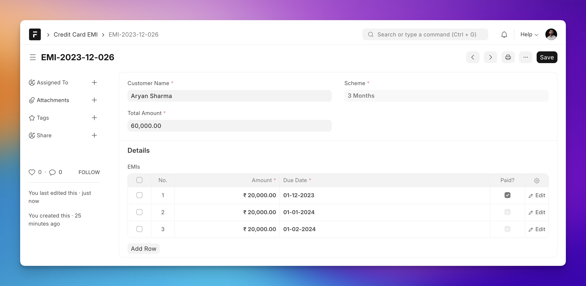
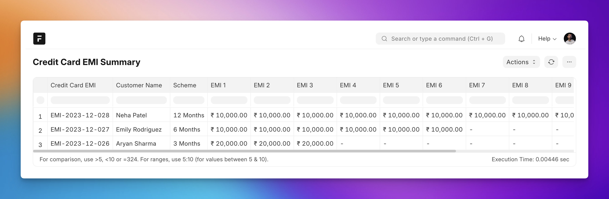

## Introduction

An example of a report that shows the child table values in a single row with the parent data. Also, columns can be dynamic.

## Use Case

Suppose we have a demo DocType named **Credit Card EMI** which has the following fields:

1. Customer Name
1. Total Amount
1. Scheme: 3/6/12 Months
1. EMIs: Child table with EMIs based on the scheme

Here is a screenshot showing the form view:



## The Report

We want to create a report that has this EMIs in different columns, like shown below:



## The Script

```py

import frappe

# maximum number of EMIs for a Credit Card EMI
# case when EMI is paid in 1 year
NUM_MAX_EMI = 12


def execute(filters=None):
 columns = get_columns()
 data = get_data(filters)

 return columns, data


def get_columns():
 columns = [
  {
   "label": "Credit Card EMI",
   "fieldname": "credit_card_emi",
   "fieldtype": "Link",
   "options": "Credit Card EMI",
  },
  {
   "label": "Customer Name",
   "fieldname": "customer_name",
   "fieldtype": "Data",
  },
  {
   "label": "Scheme",
   "fieldname": "scheme",
   "fieldtype": "Data",
  },
 ]

 # 1 column for each EMI
 for i in range(1, NUM_MAX_EMI + 1):
  columns.append(
   {
    "label": "EMI {}".format(i),
    "fieldname": "emi_{}".format(i),
    "fieldtype": "Data",
    "options": "EMI",
   }
  )

 return columns


def get_data(filters=None):
 data = []

 credit_card_emis = frappe.get_all(
  "Credit Card EMI", fields=["name", "customer_name", "scheme"]
 )

 for credit_card_emi in credit_card_emis:
  row = {
   "credit_card_emi": credit_card_emi.name,
   "customer_name": credit_card_emi.customer_name,
   "scheme": credit_card_emi.scheme,
  }

  # get all EMIs (child items) for the Credit Card EMI
  emis = frappe.get_all(
   "EMI",
   fields=["amount", "due_date", "paid", "idx"],
   filters={"parent": credit_card_emi.name},
  )

  # e.g. emi_1 = 1000, emi_2 = 2000, emi_3 = 3000, etc.
  for emi in emis:
   row["emi_{}".format(emi.idx)] = format_currency(emi.amount)

  # set rest of the EMI columns to "-"
  for i in range(1, MAX_EMI + 1):
   if "emi_{}".format(i) not in row:
    row["emi_{}".format(i)] = "-"

  data.append(row)

 return data


def format_currency(value, currency="INR"):
 return frappe.format_value(value, df={"fieldtype": "Currency"}, currency=currency)
```

## Optimizing The Data Fetching

If you observe the `get_data()` method, you will see we are calling the `frappe.get_all` method to get child items for each **Credit Card EMI** doc, which means 1 DB call per document (`O(n)` in computer *sciency* terms).

We can use the [Query Builder](https://frappeframework.com/docs/user/en/api/query-builder) to reduce this to just one database call (query is highlighted):

```py {6-19}
def get_data_with_qb(filters=None):
 data = []
 credit_card_emi = frappe.qb.DocType("Credit Card EMI")
 emi = frappe.qb.DocType("EMI")

 query = (
  frappe.qb.from_(emi)
  .join(credit_card_emi)
  .on(emi.parent == credit_card_emi.name)
  .select(
   credit_card_emi.name.as_("credit_card_emi"),
   credit_card_emi.customer_name,
   credit_card_emi.scheme,
   emi.amount,
   emi.due_date,
   emi.paid,
   emi.idx,
  )
 )

 emi_items = query.run(as_dict=True)

 # group EMI items by Credit Card EMI
 credit_card_emi_items = {}
 for emi_item in emi_items:
  credit_card_emi_items.setdefault(emi_item.credit_card_emi, []).append(emi_item)

 # create a row for each Credit Card EMI
 for credit_card_emi, emi_items in credit_card_emi_items.items():
  row = {
   "credit_card_emi": credit_card_emi,
   "customer_name": emi_items[0].customer_name,
   "scheme": emi_items[0].scheme,
  }

  # create a column for each EMI
  for emi_item in emi_items:
   row["emi_{}".format(emi_item.idx)] = format_currency(emi_item.amount)

  # set rest of the EMI columns to "-"
  for i in range(1, MAX_EMI + 1):
   if "emi_{}".format(i) not in row:
    row["emi_{}".format(i)] = "-"

  data.append(row)

 return data
```

We had to add more data processing on the Python side though.
