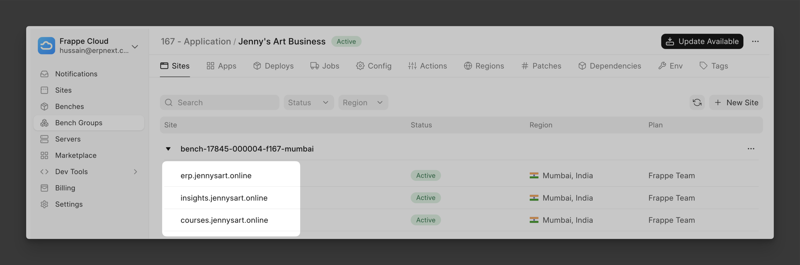

## Use Case

Suppose you have multiple Frappe sites which you use to run your business. You want your employees to have access to all these sites with a single set of credentials. So, instead of creating users in each of these sites separately, we want to use one of these sites to login into rest of the sites.

Here is a concrete example:



Jenny has 3 Frappe Cloud sites:

1. `erp.jennysart.online`: Main [ERPNext](https://erpnext.com) site with the employees already as users of this site.

2. `insights.jennysart.online`: A site that runs [Frappe Insights](https://frappe.io/insights) for data analytics.

3. `courses.jennysart.online`: A site that runs [Frappe Learning](https://frappe.io/learning) that hosts the photography courses that Jenny offers!

Jenny wants to give her employees access to insights and courses sites, but they should be able to login with the `erp.jennysart.online` site. Let's get it done!

## Implementation

Basically, we will leverage 2 feature of Frappe Framework to setup "Login with Frappe":

1. [Frappe as OAuth Client](https://frappeframework.com/docs/user/en/using_frappe_as_oauth_service): will be configured on the authentication server, in our case `erp.jennysart.online`.

1. [Social Login Key](https://frappeframework.com/docs/user/en/guides/integration/social_login_key): will be configured on the sites/clients (`insights` and `courses`) which we want to provide access to via the authentication server.

### Setting up the authentication server

Open up the `OAuth Client` DocType and create a new document:


In this case, I am doing this step in my `erp.jennysart.online` site. Here are the fields you need to set:

1. **App Name**: this can be anything that can be used to identify the client site.
2. **Skip Authorization**: I have checked this, so there is no additional confirmation step before login.
3. (and 4) **Redirect URIs** and **Default Redirect URI**: Both are set to the following URL (the endpoint comes out of the box in Framework):

    ```
    https://<client-site-url>/api/method/frappe.integrations.oauth2_logins.login_via_frappe
    ```

Once you save this form, it will automatically generate `App Client ID` and `App Client Secret` which will be needed for setting up the client in the next step.

### Setting up the client site

Now let's login to the client site (site which needs to use the authentication server for login, in this case `insights.jennysart.online`) and create a new `Social Login Key` document:


:::note[Social Login Key DocType]
This DocType is used to add OAuth based authentication methods to Frappe like Google, GitHub etc.
:::

Here is what we need to fill in:

1. `Social Login Provider`: Select **Frappe**.

2. `Client ID` and `Client Secret`: Copy-paste from the previous step (OAuth Client Form).

3. `Base URL`: The URL of the site that is setup as authentication server, i.e. `https://erp.jennysart.online`.

I have also allowed sign ups from the configuration.

That's it! Let's test it out by trying to login to `insights.jennysart.online`:

<video style="width: 100%" src="/login-with-frappe-jennys.mp4" controls title="Logging in with Frappe"></video>

Yay! You can now repeat the last two steps for setting up **Login with Frappe** on `courses.jennysart.online`.