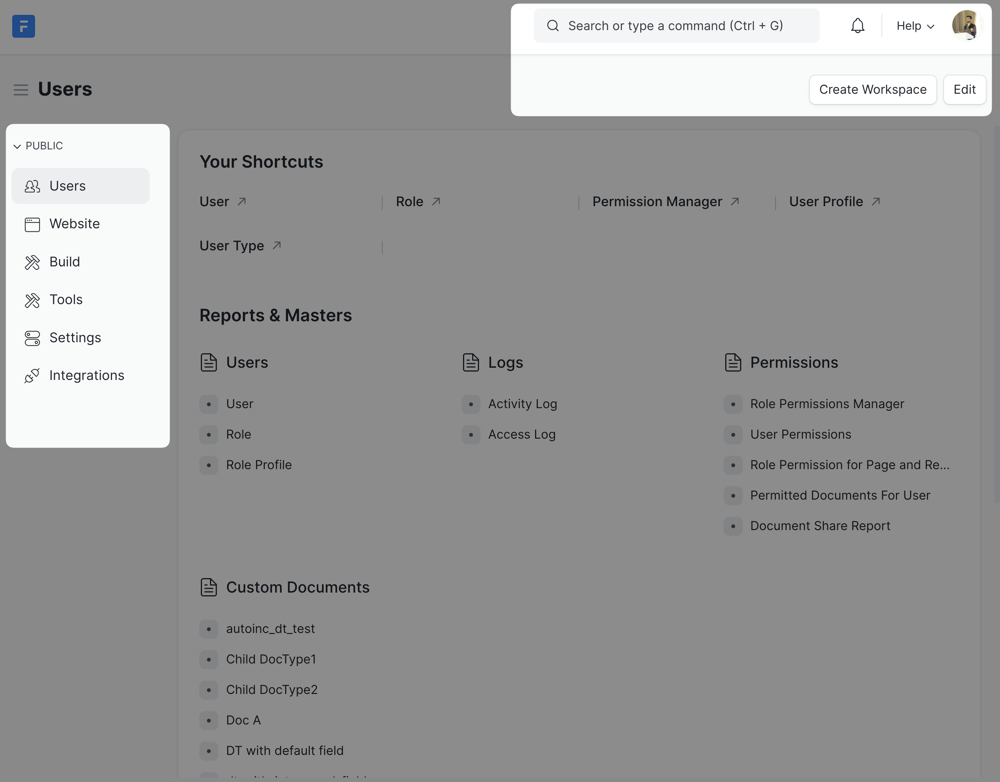
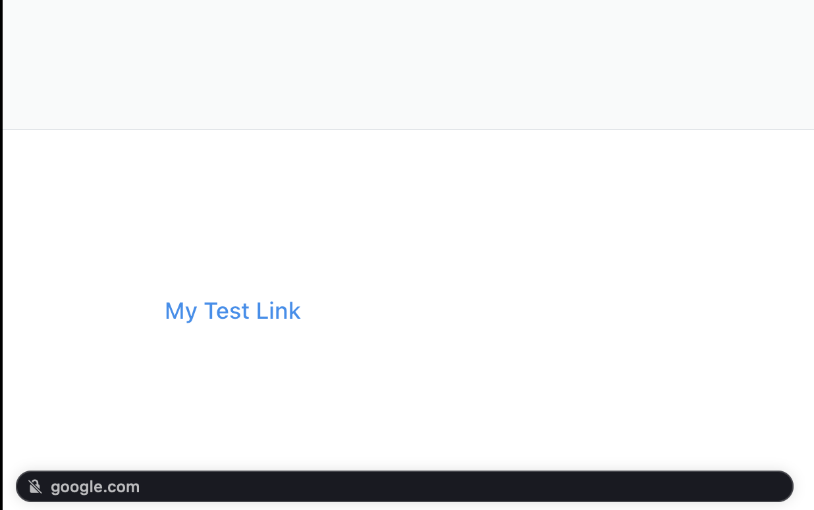

Hey there 👋🏼!

Welcome to Frappe Developer Certification Program! Good to have you onboard!

:::note
This guide(s) assumes you are new to Frappe Framework, feel free to skip sections you are confident about.
:::

In this particular guide, we will just play around with the vanilla Frappe site and jump into development concepts in Day 1 of the training.

## First Steps

Before you can get your hands dirty with building stuff with Frappe Framework, you need to have bench installed on your local machine. For using the no-code/low-code features, you can use a Frappe Cloud site, but if you want to build custom apps, you will need bench installed. Follow [this](https://frappeframework.com/docs/v14/user/en/installation) guide to install and setup bench on your site.

After you have installed the bench and created a new site, I would recommend you to start by exploring the following:

### The Desk

Explore the desk interface, this is the admin interface for your Frappe site. Specially, get yourself comfortable using this part of the navbar:

See if you can answer the following questions:

1. What is the version of Frappe the site is running on?
2. What all apps are installed on the site?
3. Can you switch to dark theme?
4. Can you set/change a profile image for yourself?

### System Settings

Navigate to the **System Settings** using the awesomebar (the search bar) and skim through the available configurations.

See if you change the following settings?

1. Number of site backups kept to 6
2. Enable the login with email link feature
3. Increase session (auth) expiry to 3 days

### Website Settings

Navigate to the **Website Settings**, this contains global settings for the portal website (not the desk, but the user facing website). See if you can figure out how to do the following:

1. Change Frappe logo to logo of your choice (maybe your company logo)
2. Add a logo in the website footer and preview it in the website
3. Add a link to the footer which points to `google.com`:

### User List

Again, you can use the awesome bar to navigate to **User List** or use the link in the **Users** workspace.

User is a DocType (more on this on day 1). This list has all the user records in the System. The **Administrator** is a special user automatically created by Frappe Framework with super admin rights (all the rights!). The other record will be the user you created while setting up the size (or in other words, during setup wizard).

Click on any particular record and browse through the fields available.

:::note[Task]
Change the password for the user (other than the administrator).
:::

See you on Day 1! ✨✨
