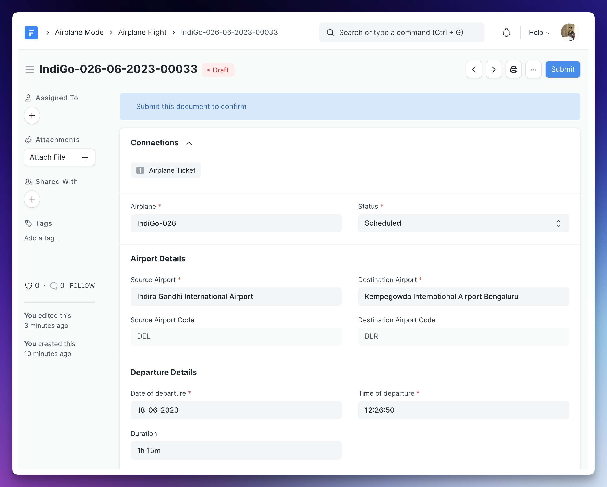
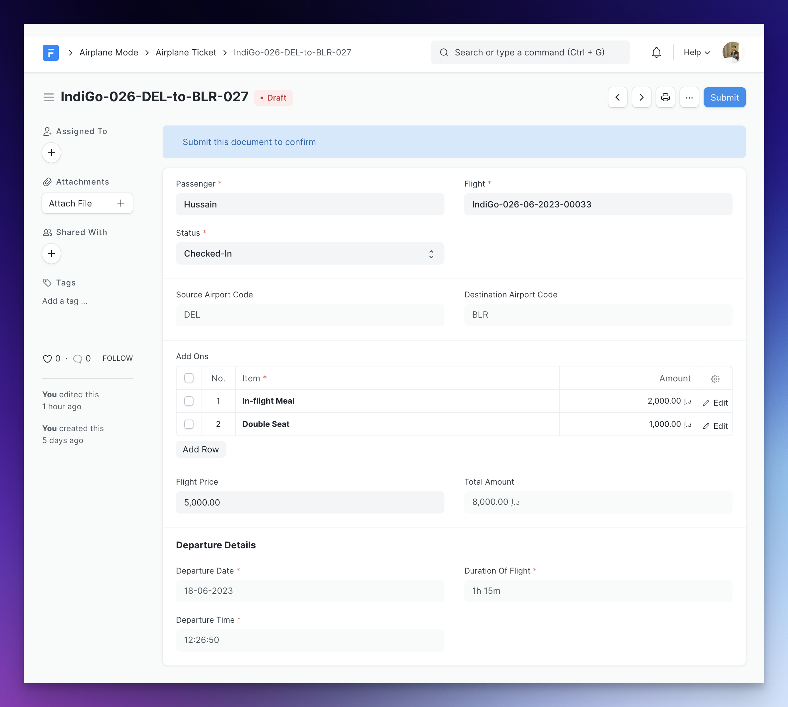
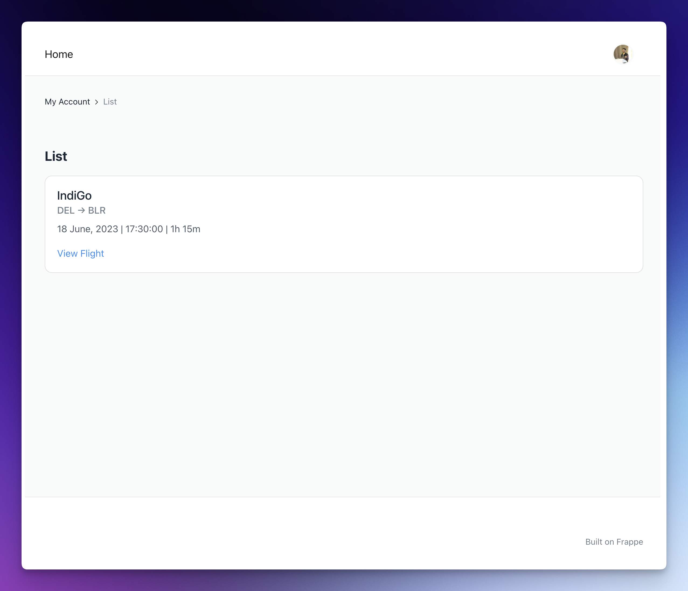
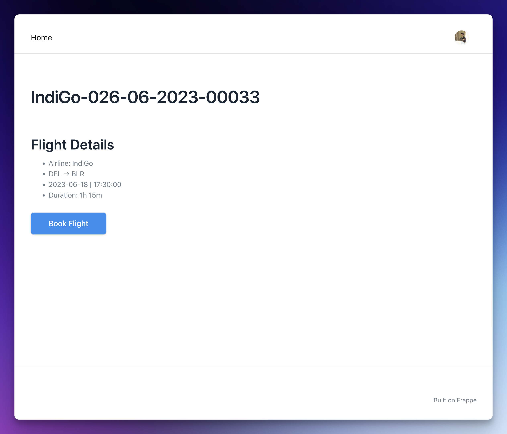
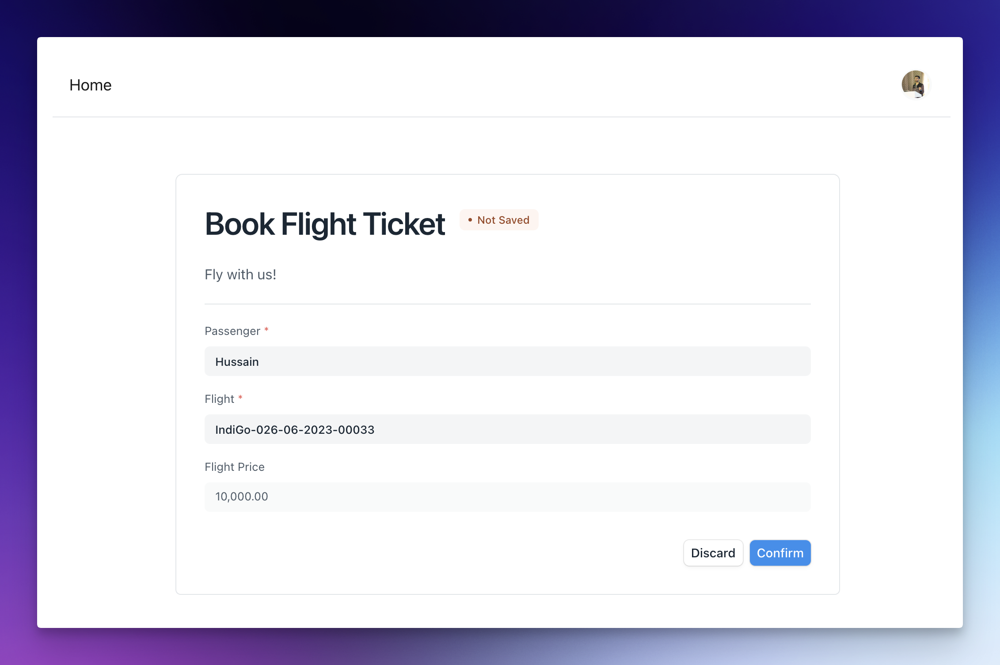
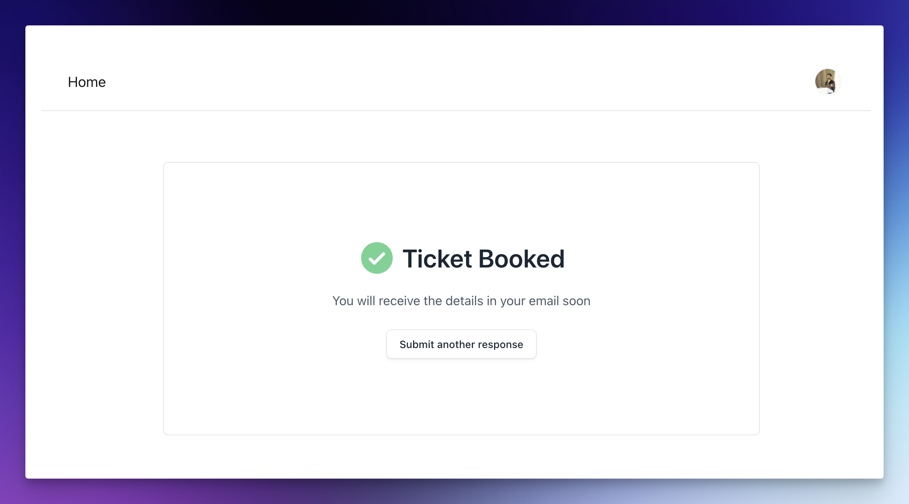

## Video Recording

The video recording of the 2nd day of training session can be found [here](https://drive.google.com/file/d/1Ab4Abwy0Rn1Ifl7t1gGxI6IHjogiUcZ2/view?usp=drive_link).

## Prerequisites

This exercise picks up where [Day 1](/handouts/day-1) left off.

## Airplane Mode - Remodelled, Controlled, Online

Now that you are equipped with the knowledge of controller methods/document hooks, web views, web forms, and more. It is time for us to take the Airplane Mode app to the next level ✨

### Let's start simple

Your goal here is add a new field named **Full Name** (read-only) to the `Flight Passenger` DocType and **auto** set it based on the `First Name` and `Last Name` field before the document is saved to the database. Write some Python code to achieve this.

:::note[Task]

Now, change the title field of `Flight Passenger` DocType to "Full Name" field instead of "First Name".

:::

### More fun: Add-Ons

If you have booked a flight ticket before, you will probably know about Add-ons. For example, along with an Airplane ticket, you can buy a in-flight meal, special seat etc. These are examples of some add-ons on our ticket. Since, this can be `N` in number and only exist along a ticket, the thing that comes to mind is a **Child Table**!

For this part of the exercise, your task is to create a new Child table doctype and add it as a table in the **Airplane Ticket** doctype.

#### New DocType: Airplane Ticket Add-on Type

Before we create the child table doctype, let us create a new doctype that stores the list of available add-ons, we can then link this to a field in our child table doctype:

**Name**

Airplane Ticket Add-on Type

**Naming Rule**

Set by user

**Fields**

1. Description: Data, description about the add-on

#### Dear Child... Table

Here are the specifications for the child table doctype:

**Name**

`Airplane Ticket Add-on Item`

**Fields**

1. Add-on Type: Link to `Airplane Ticket Add-on Type`, Mandatory
2. Amount: Currency, default 0

Now go ahead and add a table field in the **Airplane Ticket** DocType that uses this child table doctype you just created. The name of the table field must be `add_ons`.

### More Controllers

What we want now is to calculate the total amount for the ticket by adding all the add-on amounts as well as the ticket price. Start by adding 2 new fields to the `Airplane Ticket` DocType:

* Ticket Price: Currency, Mandatory
* Total Amount: Currency

After you have added the above two fields, go ahead and write the logic that populates the **Total Amount** as follows:

```
Total Amount = Ticket Price + Sum of amounts of all the add-ons
```

Sweet!

But there is a slight issue here, we don't want the user to add an add-on more than once, i.e. each type of add on in the `add_ons` child table should be unique. You know what to do right? Go ahead and write some logic that removes duplicate entries from it while the document is `validate`d!

#### All Aboard

Write a document hook to **prevent the submission** of the Airplane Ticket document if the status is not equal to `Boarded`.

:::tip[Hint]
You can use frappe.throw to throw an error along with a message
:::

### Refactoring

If you recall, the Airplane Ticket is linked to an Airplane via a Link Field. But that is not the right way to do it. If you think about it, **an Airplane takes multiple flights**, and it is the flight that the passenger is booking, not an airplane itself.

So, our task now is add a new DocType named `Airplane Flight` and refactor existing DocTypes.

#### The `Airplane Flight` DocType

This DocType will be used to track flights. Be sure to make this a *submittable* DocType, as we will mark this complete once the document is submitted.

**Name**

Airplane Flight

**Naming Rule**

Expression that generates names like: `IndiGo-001-06-2023-00001` where `IndiGo-001` is the Airplane name and `06-2023` are the month and year when this document is created.

**Fields**

1. Airplane: Link to Airplane DocType, Mandatory
2. Date of Departure: Date, Mandatory
3. Time of Departure: Time, Mandatory
4. Duration: Duration, Mandatory
5. Status: Select, Options (`Scheduled`, `Completed`, `Cancelled`), default is `Scheduled`.

Go ahead save the DocType now, we will come back and add more fields soon.

#### Changes to Airplane Ticket

Change the link of the `flight` field from `Airplane` to `Airplane Flight`. Now you know why we named it flight 😉

Since, the date of departure, time of departure and duration are now stored in the flight, fetch it from the linked Airplane Flight. I hope you remember our `Fetch From` feature!

One more thing you should do here is to move the airport link fields to the `Airplane Flight` DocType:

* Source Airport, Mandatory
* Destination Airport, Mandatory

and create 2 new fields in the `Airplane Flight` Doctype:

* Source Airport Code, Fetch from `Source Airport`
* Destination Airport Code, Fetch from `Destination Airport`

Now, update the **Source Airport Code** and **Destination Airport Code** in the `Airplane Ticket` doctype to fetch them from the **Airplane Flight** doctype instead.

While we are here, go ahead and add an new `Data` field to our airplane ticket DocType named **Seat**, which will be used to track the seat (e.g. `2A`, `31C` etc.) assigned to the passenger. Make this read-only, as we are going to automatically assign this via code.

:::note[Task]
Move the `Linked Document` connection that we added in Airplane (to Airplane Ticket) to our newly created `Airplane Flight` DocType. So that we can easily jump to the list of tickets of a flight.
:::

#### The End Result

After you are done with the above mentioned changes, the `Airplane Flight` form view should look identical to the screenshot below:



Here is how the updated `Airplane Ticket` looks like:



Phew! That was some work. But we are done now and the application is better modelled!

### A Few More Controllers

Write Python/Controller code to achieve the following outcome:

1. The **Seat** field of the `Airplane Ticket` DocType should be set to a string of the form: `<random-integer><random-capital-alphabet-from-A-to-E>`. For example, `89E`, `21A`, etc. The field should be set before a new flight ticket document is inserted into the database. You may be interested in reading the docs for [Python's random module](https://python.readthedocs.io/en/latest/library/random.html#), sections `9.6.2` and `9.6.3` in specific.

2. Set the **Status** field of the `Airplane Flight` DocType to `Completed` after the document is submitted.

:::tip[Optional]
Fix the currency symbol in the above form issue if you want to.
:::

---

## Essential Reading

It is better to go through the essential reading before you proceed to the next exercise.

* [Jinja Template Designer Documentation](https://jinja.palletsprojects.com/en/3.1.x/templates/)

* [Web View Pages Documentation](https://frappeframework.com/docs/v14/user/en/tutorial/portal-pages)

* [Portal Pages Documentation](https://frappeframework.com/docs/v14/user/en/portal-pages)

* [Web Form Documentation](https://frappeframework.com/docs/v14/user/en/web-form)

* [Documentation on serving static assets](https://frappeframework.com/docs/v14/user/en/basics/static-assets)

* [Documentation on asset bundling](https://frappeframework.com/docs/v14/user/en/basics/asset-bundling)

---

## Exercise: Show Me Colors

For this exercise, your task is to create a web page that **takes in a color as query parameter** and **shows a rectangle of that color on the page**. For example, if the user visits: `<your-site>/show-me?color=red`, they should see a red colored rectangle. If they visit `<your-site>/show-me?color=green`, they should see a green colored rectangle.

If no color query parameter is provided, **a black rectangle must be shown.**

Note: You can assume it is always a valid HTML/Web color name.

The end result should be:


:::tip[Hint]
Try rendering `frappe.form_dict` in your HTML file (Jinja template).
:::

## Web View Pages For Flights

Now it is time to let users browse and book flights from our website. This will be very simple as compared to the complex ticketing systems out there but will help us grasp web view concepts!

:::tip
Add the necessary fields required to enable web view to the `Airplane Flight` DocType. Feel free to re-watch the training session recording if you are not confident about using web views yet.
:::

Your task here is to build web view pages for the `Airplane Flight` DocType. This will be very similar to what we did with the `Vehicle` DocType during the training session:

* A list page at `/flights` that shows the list of all flights. Each list item should display the source airport code, destination airport code, date of departure, time of departure and duration of the flight. A **View Flight** link that takes the user to the detail page of that particular flight.

* The detail page for each flight at the route coming from the `route` field of the `Airplane Flight` document. A **Book Flight** link should be shown that takes the user to a web form we are going to build in the next section.

The look of the pages does not matter as long as they **display the required information**. Here are the sample pages:





Here are some hard requirements for the web view pages:

1. The **Airline**, source airport code, destination airport code, date, time of departure and duration must be shown in the both the list page and the details page.

2. There must be a view flight link in each list item of the list page which takes to the main view.

Read the section below before building the jinja templates.

### Frappe APIs in Jinja Templates

If you noticed, the Airline field is not present in the `Airplane Flight` doctype, but we are still rendering it on the web view pages above. So, how do we achieve this without adding it as a field to our doctype? Start by reading [this](https://frappeframework.com/docs/v14/user/en/api/jinja) page of the official documentation. As you can see, there are a lot of API functions available for you to call in your Jinja templates! Use an appropriate one to fetch and display the airline using the airplane field.

For example, to get the formatted duration field in the jinja template:

```py
frappe.utils.format_duration(doc.duration) # 1h 15m
```

And to get the formatted date:

```py
frappe.utils.format_date(doc.date_of_departure, "d MMMM, YYYY") # 18 June, 2023
```

## Ticket Booking Web Form

Now, it is time to allow the user to book tickets! We will use Frappe Framework's Web Form feature to do so. Here is how the completed web form should look like:





Here are some things to note:

* This web form must be linked to the Airplane Ticket doctype

* The flight price field in web form must be read only, it should be set (to any value you want) automatically when the user navigates to this page from the flight details page

* The flight must be automatically set when the user navigates to this web form from the flight details page

## Flight Departure Notification

Use the **Notification** feature in Frappe to send a **System Notification** to every System Manager **1 day before the flight departure date** of any Airplane Flight where the status is `Scheduled`. The subject of the notification must be "Departs in 24 hours!".

Make sure you check the **Is Standard** checkbox and set the module, so that it generates a file in your custom app.

## Submission [Mandatory for Certification]

:::note
If you are unable to complete any task, please feel free to ask them in the next training session or on TG after that. But DO NOT give up before that, try to read the docs, Frappe source code etc. if you don't know something.
:::

Go to your custom app where the files have been generated and upload the following in the submission form below:

1. `airplane_flight.json`
2. `airplane_ticket.json`
3. The file(s) that power the **Show Me Colors** portal page
4. `airplane_flight.html` and `airplane_flight_row.html`
5. The JSON file generated for the **Book Flight Ticket** Web form (look inside the **web_form** directory of your custom app, the name of the file depends on the title you gave to the web form)
6. The JSON file generated for the **Departs in 24 hours!** notification (look inside the `notification` directory in your custom app)
7. `airplane_ticket.py`
8. `airplane_passenger.py`

:::danger[Before You Submit]

1. Change the extension of all the files to `.txt` before uploading the files.
2. DO NOT upload links to file, attach the file from your local computer
3. Make sure the DocType names and field names match the above mentioned verbatim.
:::

Use [this](https://cms.buildwithhussain.dev/fschool-assignment-submission/new) form to submit your assignment. Select `2` for the day field.

If you have any problems in submitting the assignment, please drop me an email at [hussain@frappe.io](mailto:hussain@frappe.io)

---

Awesome! That is it for today, check out the optional challenges section for some open ended practice tasks!

## In Action: Web Views & Portal Pages

### FrappeLMS Portal Pages

Check [this](https://github.com/frappe/lms/tree/main/lms/www) out, this is the `www` directory of the FrappeLMS app, it is 🤯

The whole (complex) frontend is build on portal pages!

### FC Marketplace Web View

Now check [this](https://github.com/frappe/press/blob/master/press/press/doctype/marketplace_app/templates/marketplace_app.html) file, this is the web view template of the marketplace app detail page! For example, [this](https://frappecloud.com/marketplace/apps/gameplan) is the detail for Gameplan marketplace app.

I hope this examples convince you to leverage the power of web views and portal pages in your own custom apps!

## Optional Challenges

You can do this after you have submitted the assignment:

1. Build a home/landing page for your flight booking agency using portal pages.

2. Advanced: Build doctypes and logic to assign proper seats instead of random seats.

3. Write a controller method to submit all `Airplane Ticket`s that are linked to an `Airplane Flight` and are `Boarded` on the submission of an `Airplane Flight` document.

4. Create 4-5 Airplane Ticket Add-on Type documents and export them as fixtures.
