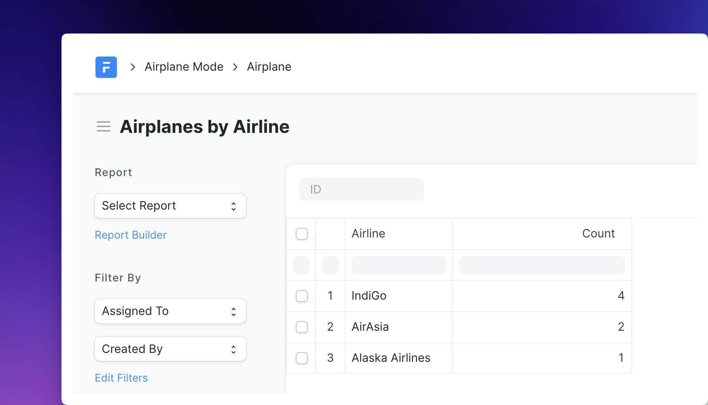
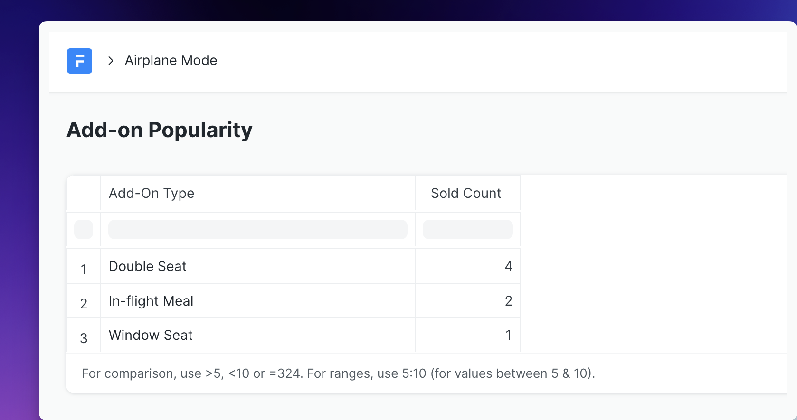
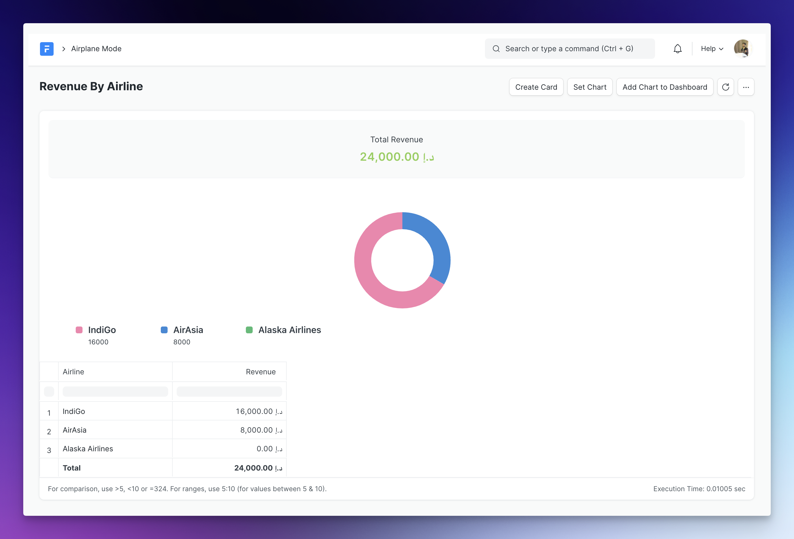
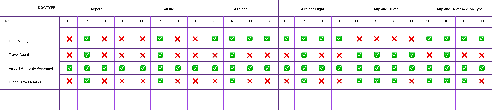

## Video Recording

The video recording of the 3rd day of training session can be found [here](https://drive.google.com/file/d/1Lr-HpwibZPx0eEA9wvX_4UZ35YRWepTt/view?usp=drive_link).

## Gimme Some JavaScript Please

### Website Link

Your task here is to add a website link to the `Airline` form view which links to the official website for the airline. Start by adding a new field named **Website** to the **Airline** DocType. Now, write a script (in the proper file 😉) that will add a custom web link to the web form that points to the official website of that particular airline. Here is it should work:

Note that *if the website field is empty, the link must not be added*.

:::tip
You can set the options property of a `Data` field to `URL` to get automatic URL validations and a nice icon navigation! There is also `Email` if you want to use it somewhere.
:::

### Seat Assignment

Demo first, instructions second:

The task is simple here, add a custom button like the one shown above and on click, show a dialog with an input field to get the seat number and set it to the `Seat` field in the form. Easy to do, right?

## Some More Learning

Let us learn a few more features of the DocType form.

### Image Field

<iframe width="560" height="315" src="https://www.youtube.com/embed/a3he-BVesUU" title="YouTube video player" frameborder="0" allow="accelerometer; autoplay; clipboard-write; encrypted-media; gyroscope; picture-in-picture; web-share" allowfullscreen></iframe>

### Display Depends On

This will let you toggle the visibility of a field based on a JavaScript expression:

<iframe width="560" height="315" src="https://www.youtube.com/embed/H_gWt0EPZCE" title="YouTube video player" frameborder="0" allow="accelerometer; autoplay; clipboard-write; encrypted-media; gyroscope; picture-in-picture; web-share" allowfullscreen></iframe>

### One Last Controller

> Promise, this is the last one 🤣

If you check the **Airplane** DocType, we have a field named `Capacity`, which stores the number of seats that particular airplane has. Write a controller method that **prevents the creation of a new Airplane Ticket** if the **number of tickets for that flight exceed the number of seats in that flight's airplane**. You can throw an error (using `frappe.throw`) if this condition is satisfied.

## Reporting Time

### Airplanes By Airline

This report will be used to quickly analyze how many Airplanes does each Airline operates.

Use the **Report Builder** type report to build the below shown report:

### Add-on Popularity

The data analysts at the company using your Airplane mode app want to know which ticket add-ons are the most popular, so that they can decide which add-ons to invest more on and improve.

Your task is to create a report just like the one shown below:

You won't be able to use the Report Builder for this one (think why?), so you have to use the Query report type and write some SQL to get this done!

Here are some properties of this report:

1. The report shows the **number of times a particular type of add-on was sold** (i.e. was included in a ticket).

2. The rows are sorted in the descending order of "Sold Count" column.

3. The column labels must match the ones above and first column should be a `Link` type and second must be a `Int` type.

### Revenue By Airline

Now this is a very important report, the company wants to check which Airline is making more money 🤑

Your task to create a report like the one shown below:

This report must be a *Standard* **Script Report** that shows how much revenue each Airline in the system has made.

Here are some properties of this report:

1. The report has a **Donut Chart** with the distribution of revenue by airlines.

2. The report has a summary section which shows the **Total Revenue**. It also has a total row.

3. `Airline` is a `Link` type column and revenue is a `Currency` type column.

4. Even Airlines with 0 revenue are included.

:::note[FYI]
The revenue comes from the tickets.
:::

## Access Granted

Now is the time to setup some roles and permissions for our Airplane Mode app!

### Setup Roles

Here are a primary user roles that your app will need, with the description of each:

1. **Airport Authority Personnel**: These will be the users that have a very high access level. They will be able to manage not only Airlines and Flights, but Airports too!

2. **Fleet Manager**: This will be given to the Fleet managers. They maintain airplanes.

3. **Travel Agent**: This will be given to the travel agents who will use the system to book tickets on behalf of their passengers. They will also be able to manage passengers that they create.

4. **Flight Crew Member**: This role will be given to the users

### Setup DocType Permissions

In many implementation cases, the client shares a role-permission matrix that has the permissions mapped to different roles in the system. Here is a permission matrix for our Airplane Mode:

You can open in the above image in a new tab to zoom in as required.

Remember, the travel agent should only be able to read, update or delete the records which she has created.

### Airplane Audits

The **Airport Authority Personnel**s conduct audits for each Airplane after they are created in the system. Add a new checkbox field in `Airplane` doctype named **Initial Audit Completed** to track wether the audit was completed.

But here is the requirement, this field **should only be visible and editable** by users having **Airport Authority Personnel** role.

## Essential Reading

* [BLOG SERIES] Building An eBook Store on Frappe
  * [Part 1: Building The Storefront](https://frappe.io/blog/engineering/building-an-online-ebook-store-with-frappe-bulma-razorpay-part-I)
  * [Part 2: Payment & Delivery](https://frappe.io/blog/engineering/building-an-online-ebook-store-part-ii)
  * [Part 3: Interactivity & Deploy](https://frappe.io/blog/engineering/building-an-online-ebook-store-part-iii)

* [Frappe Query Builder Docs](https://frappeframework.com/docs/v14/user/en/api/query-builder)

* [Reports Documentation](https://frappeframework.com/docs/v14/user/en/desk/reports)

## Essential Viewing

1. [BWH Ep. 3: Python Essentials & Server Scripts](https://www.youtube.com/watch?v=Tk6ZPmiV5DA)
1. [BWH Ep. 7: JavaScript Essentials & Client Scripts](https://www.youtube.com/watch?v=vqVd2cId1ys)
1. [BWH Ep. 1: Full-stack Apps with FrappeUI & Frappe Framework](https://www.youtube.com/watch?v=djpXDquzrvQ)

## Optional Reading

* [BLOG] [MongoDB Powered DocTypes in Frappe Framework using the Virtual DocTypes feature](https://frappe.io/blog/engineering/mongodb-powered-doctypes)

---

## Submission [Mandatory for Certification]

:::note
If you are unable to complete any task, please feel free to ask them in the next training session or on TG after that. But DO NOT give up before that, try to read the docs, Frappe source code etc. if you don't know something.
:::

Go to your custom app where the files have been generated and upload the following in the submission form below:

1. `airline.js`
2. `airplane_ticket.js`
3. `airplane_ticket.py`
4. JSON file for "Airplanes by Airline" report (check the report directory of your custom app)
5. JSON file for "Add-on Popularity" report
6. Python file for "Revenue By Airline" report
7. `airplane_ticket.json`
8. `airplane.json`
9. `airport.json`

:::danger[Before You Submit]

1. Add `.txt` extension to all the files before uploading/attaching. For instance, `airplane_ticket.py` becomes `airplane_ticket.py.txt`
2. DO NOT upload links to file, attach the file from your local computer
3. Make sure the DocType names and field names match the above mentioned verbatim.
:::

Use [this](https://cms.buildwithhussain.dev/fschool-assignment-submission/new) form to submit your assignment. Select `3` for the day field.

If you have any problems in submitting the assignment, please drop me an email at [hussain@frappe.io](mailto:hussain@frappe.io)

---

## The Path Ahead

After submission, feel free to extend the Airline Mode application as you see fit, play around and model more DocTypes, create more reports, setup more roles, and most importantly have fun!

Here are some ideas for you to delve into:

1. Write unit tests to make sure your core backend functionality works

2. Improve the web views with better UI and more information

3. Dynamic creation of flights for various future dates

4. Install [**Frappe Insights**](https://github.com/frappe/insights) and build a Dashboard for Airplane Mode app

5. Allow users to sign up and create a passenger profile and use that profile to book flights

You can do so much more! Build your own apps, automate your mundane tasks, integrate with 3rd party API/services, setup payments, ... oh my! **The sky is your limit.**

### Explore The Frappeverse

You can start by checking out [Frappe Cloud](https://frappecloud.com) and [FC Marketplace](https://frappecloud.com/marketplace).

Some more Frappe awesomeness:

* [Frappe Incubator](https://frappe.io/incubator): Frappe Incubator is a program that funds open source tools built on the Frappe platform
* [FrappeUI](https://github.com/frappe/frappe-ui): UI Components library by Frappe
* [Doppio](https://github.com/NagariaHussain/doppio): A CLI to magically setup Vue/React SPA in your custom Frappe apps
* [Frappe Blog](https://frappe.io/blog): Technical & Non-technical write-ups by Frappe Team
